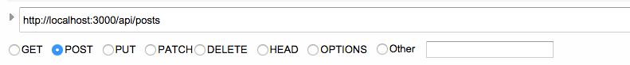
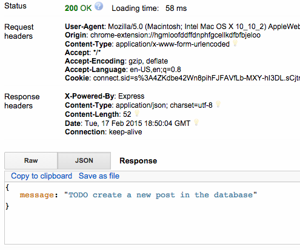
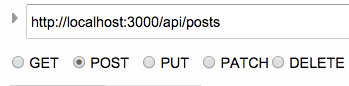
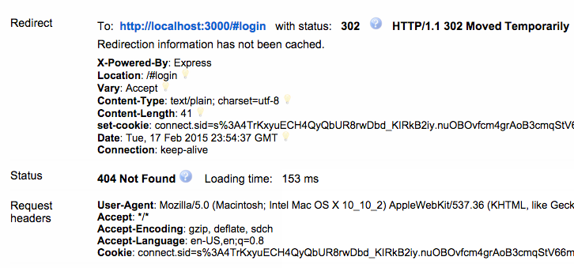
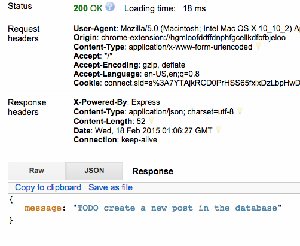

# Module 3: Introduction to Node.js and Express

## Objective

By the end of this module you will know:

- The basic advantages of [Node.js](http://nodejs.org)
- What the [Node Package Manager](http://npmjs.org) (npm) is
- Creating [Express](http://expressjs.com) API Routes
- How to add authentication to APIs using [passport](http://npmjs.org/packages/passport)
- The basics of Route [Middleware](http://expressjs.com/guide/using-middleware.html)


## Introduction

In this section, we'll transition to the back-end of the Chirp! application. To start the beginnings of the back-end we'll need to create a new express application, add new routes to service our angular.js application and add authentication to protect some of our apis.

## Node.js

Node.js or simply Node is an asynchronous I/O engine which allows you to write fast, scalable applications on the server using javascript. Its implemented on top of [Chromium's V8 Javascript](http://code.google.com/p/v8) runtime.

Node is single threaded and uses what is called an Event Loop to manage asynchronous tasks. We won't cover that aspect in detail in this module.

## Node Package Manager (npm)

Npm is the package manager for Node. The package manager is responsible for hosting open source modules for the use by Node community. Every application contains a **package.json** file within its directory which is a manifest of the dependencies required for the application to run.

## Getting Started

We will Start developing in the [Start](./Start) directory and after this module we will be left with what can be found in the [Finished])(./Finished) directory.

### Generating a blank Express Application

The first thing we need to do is generate an express application using Node.js. To do this we'll execute the following commands from this directory:

```bash
# create a new express application
mkdir ./Start
cd ./Start
express --ejs .
```

Express will output the files that it creates:

```
create : .
   create : ./package.json
   create : ./app.js
   create : ./public
   create : ./public/javascripts
   create : ./public/images
   create : ./public/stylesheets
   create : ./public/stylesheets/style.css
   create : ./routes
   create : ./routes/index.js
   create : ./routes/users.js
   create : ./views
   create : ./views/index.ejs
   create : ./views/error.ejs
   create : ./bin
   create : ./bin/www

   install dependencies:
     $ cd . && npm install

   run the app:
     $ DEBUG=Start ./bin/www
```

Now install the dependencies for the application. Npm will read the dependencies out of package.json  and place them into a directory named **node_modules**. Execute the command:

```bash
# install dependencies described in package.json
npm install
```

In the **routes** folder delete the **user.js** file, and create two new javascript files, **authenticate.js** and **api.js**

```bash
# navigate to routes folder
cd ./routes
# remove users.js
rm users.js
# remove index.js
rm index.js
# create authentication.js and api.js files
touch authentication.js
touch api.js
```

Let's take a look at our generated **app.js** which is the main application file:

```js
var express = require('express');
var path = require('path');
var favicon = require('serve-favicon');
var logger = require('morgan');
var cookieParser = require('cookie-parser');
var bodyParser = require('body-parser');

var routes = require('./routes/index');
var users = require('./routes/users');

var app = express();

// view engine setup
app.set('views', path.join(__dirname, 'views'));
app.set('view engine', 'ejs');

// uncomment after placing your favicon in /public
//app.use(favicon(__dirname + '/public/favicon.ico'));
app.use(logger('dev'));
app.use(bodyParser.json());
app.use(bodyParser.urlencoded({ extended: false }));
app.use(cookieParser());
app.use(express.static(path.join(__dirname, 'public')));

app.use('/', routes);
app.use('/users', users);

// catch 404 and forward to error handler
app.use(function(req, res, next) {
    var err = new Error('Not Found');
    err.status = 404;
    next(err);
});

// error handlers

// development error handler
// will print stacktrace
if (app.get('env') === 'development') {
    app.use(function(err, req, res, next) {
        res.status(err.status || 500);
        res.render('error', {
            message: err.message,
            error: err
        });
    });
}

// production error handler
// no stacktraces leaked to user
app.use(function(err, req, res, next) {
    res.status(err.status || 500);
    res.render('error', {
        message: err.message,
        error: {}
    });
});


module.exports = app;
```

This is the boiler plate code required to run our express application. The [require]() statements allow us to import javascript code. We'll use these to import our API routing code and register them with Express. Let's remove the current require statements to **index.js** and **users.js**:

```js
var routes = require('./routes/index');
var users = require('./routes/users');
```

And replace them with:

```js
var api = require('./routes/api');
//We will uncomment this after implementing authenticate
//var authenticate = require('./routes/authenticate');
```

To register the route handlers with Express, we'll have to remove the current registrations with **index** and **users**:

```js
app.use('/', routes);
app.use('/users', users);
```

and replace it with

```js
//app.use('/auth', authenticate);
app.use('/api', api);
```

Now we're setup to load **authenticate.js** and **api.js** as application routers. Now we need to implement it.

## Implementing the RESTful API

RESTful APIs follow a convention which present *resources* to the client. In our case a **Post** is a resource and because of this we will implement a **/posts** API which will 
First we'll implement placeholder route handlers for the **/posts** api within **api.js**.

Every router begins with a require to express, and using the express Router class. At the end of the router implementation we **export** this module as the Router to be consumed by the code we added in **app.js**

```
var express = require('express');
var router = express.Router();

//  Some implementation....


module.exports = router;
```

Now between these two things we need to add the **/posts** api handlers. The way this works in express is by registering the handler to a specific HTTP method, such as GET, PUT, POST or DELETE. Let's add the handlers for the **/posts** route:


```js
var express = require('express');
var router = express.Router();

//api for all posts
router.route('/posts')
	
	//create a new post
	.post(function(req, res){

		//TODO create a new post in the database
		req.send({message:"TODO create a new post in the database"});
	})

	.get(function(req, res){

		//TODO get all the posts in the database
		req.send({message:"TODO get all the posts in the database"});
	})
	


module.exports = router;
```

Now that we got our **/posts** api completed we need to create some apis for individual posts. We can do this by building off of our **/posts** path and adding an ID specific route  for an individual post. We use the ':' notation in our route name which tells Express that that particular part of the route will be treated as a parameter:

```js
//api for all posts
router.route('/posts')
	
	//create a new post
	.post(function(req, res){

		//TODO create a new post in the database
		res.send({message:"TODO create a new post in the database"});
	})

	.get(function(req, res){

		//TODO get all the posts in the database
		res.send({message:"TODO get all the posts in the database"});
	})

```

Finally our full router implementation looks like this:

```js
var express = require('express');
var router = express.Router();

//api for all posts
router.route('/posts')
	
	//create a new post
	.post(function(req, res){

		//TODO create a new post in the database
		res.send({message:"TODO create a new post in the database"});
	})

	.get(function(req, res){

		//TODO get all the posts in the database
		res.send({message:"TODO get all the posts in the database"});
	})

//api for a specfic post
router.route('/posts/:id')
	
	//create
	.put(function(req,res){
		return res.send({message:'TODO modify an existing post by using param ' + req.param.id});
	})

	.get(function(req,res){
		return res.send({message:'TODO get an existing post by using param ' + req.param.id});
	})

	.delete(function(req,res){
		return res.send({message:'TODO delete an existing post by using param ' + req.param.id})
	});

module.exports = router;
```

To start the application, got to the **./Start** folder and execute:

```bash
# starts the application via npm
npm start
```

## Testing Your APIs

To test your API's we'll use [Advanced Rest Client](https://chrome.google.com/webstore/detail/advanced-rest-client/hgmloofddffdnphfgcellkdfbfbjeloo) a Chrome browser application that allows us to test our API's without having to write code. You can also use [Postman](https://chrome.google.com/webstore/detail/postman-rest-client/fdmmgilgnpjigdojojpjoooidkmcomcm) another great application to do the same.

Open Chrome and either install or open Advanced Rest Client. We will make a request to each API we implemented ensure we get the correct place-holder message:





Note that because in app.js we assigned express to use the **api** router at **/api** all routes in this file will have the prefix ''**/api**'

Ensure that you get the correct 'TODO' message for the remaining **/api/posts**.

To test the **/api/posts/:id** routes you can simply use any string for the :id part of the path. When we implement the API with MongoDB, we'll use the generated ID's from MongoDB.

# Adding the Authentication APIs

Most applications require some type of authentication to provide some basic identity to users. Adding local authentication is quite easy. It involves using browser [sessions](http://en.wikipedia.org/wiki/Session_(computer_science)) as semi-permanent data in which users are authenticated and some APIs to allow the creation of users in the database.


## Installing the Modules

Passport is the library we will use to handle storing users within HTTP sessions. Express-session is middleware for handling sessions and bcrypt will allow us to store our passwords as hashes as its never a good idea to store passwords. First we have to install a few modules. Navigate to the [./Start](./Start) folder and execute:

```js
# install express session middleware
npm install express-session --save
# install passport
npm install passport --save
# install passport-local strategy for handling authentication
npm install passport-local --save
# install bcrypt-nodejs for handling creating password hashes
npm install bcrypt-nodejs --save
```

## Express Middleware

Middleware are units of code which have access to both the **request** **response** and the next route middleware in line. These code units are executed before the route handler has the opportunity to execute and they can be assigned at the router level or to the entire express application.

You can think of these things as 'middlemen' standing between your client and your route handler to provide some general functionality. 

### Session Middleware

We will use the **express-generator** middleware at the application level to handle maintaining sessions. To do this go to **app.js** and add the following require statement at the top:

```js
var session = require('express-session');
```

Now change your middleware section to use the session module:

```js
// uncomment after placing your favicon in /public
//app.use(favicon(__dirname + '/public/favicon.ico'));
app.use(logger('dev'));
//Add this portion to your middleware section
app.use(session({
  secret: 'keyboard cat'
}));
//
app.use(bodyParser.json());
app.use(bodyParser.urlencoded({ extended: false }));
app.use(cookieParser());
app.use(express.static(path.join(__dirname, 'public')));
```

It's important to note that sometimes the order of the middleware matters. In our case we can place it at the very top.

The session manager uses a **secret** to maintain sessions. In practice, you should keep this secret value outside of your code repository in an environment variable.

### Bootstrapping Passport

To bootstrap passport first we'll require passport in **app.js**:

```js
var passport = require('passport');
```

Now, add passport as an application level middleware. We'll add it to the bottom of the middleware chain:

```js
// uncomment after placing your favicon in /public
//app.use(favicon(__dirname + '/public/favicon.ico'));
app.use(logger('dev'));
app.use(session({
  secret: 'keyboard cat'
}));
app.use(bodyParser.json());
app.use(bodyParser.urlencoded({ extended: false }));
app.use(cookieParser());
app.use(express.static(path.join(__dirname, 'public')));
app.use(passport.initialize());
app.use(passport.session());
```

### Initializing Passport

We need to Initialize Passport. Passport has it's own middleware handlers in which you assign at 'Strategy'. We will use a Local strategy since we'll just be using local accounts and not any higher level authentication such as Social authentication via Facebook. You can read more about this on the [Passport documentation](http://npmjs.org/packages/passport).

In order to properly initialize passport we need to initialize it with its own middleware which will tell passport how to persist users in our datastore. Next module we'll introduce [mongodb](http://mongodb.com) a NoSQL document oriented database to store our users. In the mean-time we'll just store the users in memory using a javascript object.

Add a new javascript file within the [./Start](./Start) directory

```
#create passport-init.js file
touch passport-init.js
```

Now copy and paste this boiler plate passport initialization code which creates the middleware authentication handlers to the Passport specification and exports it as a module:

```js
var LocalStrategy   = require('passport-local').Strategy;
var bCrypt = require('bcrypt-nodejs');
//temporary data store
var users = {};
module.exports = function(passport){

	// Passport needs to be able to serialize and deserialize users to support persistent login sessions
	passport.serializeUser(function(user, done) {
		console.log('serializing user:',user.username);
		return done(null, user.username);
	});

	passport.deserializeUser(function(username, done) {

		return done('we have not implemented this', false);

	});

	passport.use('login', new LocalStrategy({
			passReqToCallback : true
		},
		function(req, username, password, done) { 

			return done('we have not implemented this', false);
		}
	));

	passport.use('signup', new LocalStrategy({
			passReqToCallback : true // allows us to pass back the entire request to the callback
		},
		function(req, username, password, done) {

			return done('we have not implemented this', false);

		})
	);
	
	var isValidPassword = function(user, password){
		return bCrypt.compareSync(password, user.password);
	};
	// Generates hash using bCrypt
	var createHash = function(password){
		return bCrypt.hashSync(password, bCrypt.genSaltSync(10), null);
	};

};
```

The code above registers LocalStrategy instances for the signup and login actions in passport. These functions will be responsible for providing passport the user objects from our data storage. Obviously the code above is not complete.

We also have two utility functions **createHash** **isValidPassword** for hashing and checking passwords.

At top near your require statements in **passport-init.js** add a declaration for the **users** js object:

```
var LocalStrategy   = require('passport-local').Strategy;
var bCrypt = require('bcrypt-nodejs');
//temporary data store
var users = {};
```

Let's implement the **signup** action first:

```js
passport.use('signup', new LocalStrategy({
			passReqToCallback : true // allows us to pass back the entire request to the callback
		},
		function(req, username, password, done) {

			findOrCreateUser = function(){

				return done('we have not implemented this', false);
			};

			return findOrCreateUser();
		})
	);
```

The **signup** handler is pretty self explanatory. All we need to do is check if the username is on the user object we created otherwise we store the username and password as a key entry in the users object:

```js
passport.use('signup', new LocalStrategy({
			passReqToCallback : true // allows us to pass back the entire request to the callback
		},
		function(req, username, password, done) {

			if (users[username]){
				console.log('User already exists with username: ' + username);
				return done(null, false);
			}
	
			//store user in memory 
			users[username] = {
				username: username,
				password: createHash(password)
			}
			
			console.log(users[username].username + ' Registration successful');
			return done(null, users[username]);
		})
);
```

To conform to passports specifications, we must call the **done** callback function on every exit point of the function.

The **login** handler is also quite simple. Just check if the user is in the data store and if the password matches the hash stored:

```js
passport.use('login', new LocalStrategy({
			passReqToCallback : true
		},
		function(req, username, password, done) { 

			if(users[username]){
				console.log('User Not Found with username '+username);
				return done(null, false);
			}

			if(isValidPassword(users[username], password)){
				//sucessfully authenticated
				return done(null, users[username]);
			}
			else{
				console.log('Invalid password '+username);
				return done(null, false)
			}
		}
));
```

Finally the serialize and deserialize handlers need to be provided a unique ID for each user. We can just use the username because those will be unique:

```js
// Passport needs to be able to serialize and deserialize users to support persistent login sessions
passport.serializeUser(function(user, done) {
	console.log('serializing user:',user.username);
	//return the unique id for the user
	done(null, user.username);
});

//Desieralize user will call with the unique id provided by serializeuser
passport.deserializeUser(function(username, done) {

	return done(null, users[username]);

});
```
Putting it all together our **passport-init.js** looks like:

```js
var User = require('./models/models');
var mongoose = require('mongoose');   
var User = mongoose.model('User');
var LocalStrategy   = require('passport-local').Strategy;
var bCrypt = require('bcrypt-nodejs');
users = {};
module.exports = function(passport){

	// Passport needs to be able to serialize and deserialize users to support persistent login sessions
	passport.serializeUser(function(user, done) {
		console.log('serializing user:',user.username);
		//return the unique id for the user
		done(null, user.username);
	});

	//Desieralize user will call with the unique id provided by serializeuser
	passport.deserializeUser(function(username, done) {

		return done(null, users[username]);

	});

	passport.use('login', new LocalStrategy({
			passReqToCallback : true
		},
		function(req, username, password, done) { 

			if(users[username]){
				console.log('User Not Found with username '+username);
				return done(null, false);
			}

			if(isValidPassword(users[username], password)){
				//sucessfully authenticated
				return done(null, users[username]);
			}
			else{
				console.log('Invalid password '+username);
				return done(null, false)
			}
		}
	));

	passport.use('signup', new LocalStrategy({
			passReqToCallback : true // allows us to pass back the entire request to the callback
		},
		function(req, username, password, done) {

			if (users[username]){
				console.log('User already exists with username: ' + username);
				return done(null, false);
			}

			users[username] = {
				username: username,
				password: createHash(password)
			}
			
			console.log(users[username].username + ' Registration successful');
			return done(null, users[username]);
		})
	);
	
	var isValidPassword = function(user, password){
		return bCrypt.compareSync(password, user.password);
	};
	// Generates hash using bCrypt
	var createHash = function(password){
		return bCrypt.hashSync(password, bCrypt.genSaltSync(10), null);
	};

```

Finally we have to initialize passport with the authentication strategies we've defined in **passport-init.js**. Add this segment of code after the middleware section in app.js:

```js
//// Initialize Passport
var initPassport = require('./passport-init');
initPassport(passport);
```

This will call the passport initialization and allow those functions to be called whenever a user needs to authenticate.

## Integrating Passport

Now that we have our strategies implemented we need to integrate it to some authentication routes.

### Implementing the Auth Routes

First, let's uncomment the require to **authenticate.js** require within **app.js** and pass it the **passport** module:

```js
var authenticate = require('./routes/authenticate')(passport);
```

**Authenticate.js** will be written as a router, similar to **api.js** except it will expose a function that will take the **passport** module and return the router:

```js
var express = require('express');
var router = express.Router();

module.exports = function(passport){

	//sends successful login state back to angular
	router.get('/success', function(req, res){
		res.send({state: 'success', user: req.user ? req.user : null});
	});

	//sends failure login state back to angular
	router.get('/failure', function(req, res){
		res.send({state: 'failure', user: null, message: "Invalid username or password"});
	});

	//log in
	router.post('/login', passport.authenticate('login', {
		successRedirect: '/auth/success',
		failureRedirect: '/auth/failure'
	}));

	//sign up
	router.post('/signup', passport.authenticate('signup', {
		successRedirect: '/auth/success',
		failureRedirect: '/auth/failure'
	}));

	//log out
	router.get('/signout', function(req, res) {
		req.logout();
		res.redirect('/');
	});

	return router;

}
```

Above we've implemented a **/login**, **/signup** and **signout** route. Passport provides the **successRedirect** and **failureRedirect** fields to redirect the client to  the correct endpoint after an attempted sign-in.

Notice the **req.logout** function within the **/signout** route handler. This is middleware added by the passport library to facilitate logging a user out of their session.

### Protecting APIs with Authentication using Middleware

Now that we've added our authentication APIs we can actually create our own middle ware to protect some of our APIs.

For Chirp! we want to allow anyone to read posts, but modifying and creating new posts is exclusively for registered users.

Instead of checking in each of our route handlers we'd like to protect if the user is authenticated, we just have to add add one middleware function that will do it.

Within **api.js** add this function and middleware registration:

```js
//Used for routes that must be authenticated.
function isAuthenticated (req, res, next) {
	// if user is authenticated in the session, call the next() to call the next request handler 
	// Passport adds this method to request object. A middleware is allowed to add properties to
	// request and response objects

	//allow all get request methods
	if(req.method === "GET"){
		return next();
	}
	if (req.isAuthenticated()){
		return next();
	}

	// if the user is not authenticated then redirect him to the login page
	return res.redirect('/#login');
};

//Register the authentication middleware
router.use('/posts', isAuthenticated);
```

Now, all requests that aren't GET (generally, requests that do not make any changes) are allowed. However any POST or PUT requests for either **/posts** or **posts/id** will receive a redirect and in our case we'll point the client to the front-end login route.

## Testing the Authenticated APIs

### Negative Testing the Posts API

We can test the APIs by using a rest client like we did previously. First let's try a [negative test]()  with an API that we know we should be authenticated to:



After we make the request the response should be a 301 redirect to the /#login front-end route:



The GET endpoint should be unaffected and behave as before.

### Positive Testing the Posts API

Now, if we signup and login we should be able to call the POST method on the **/api/posts** endpoint:




# Conclusion

We've created all the necessary routes in express to service our angular application. In this section we've covered how to get started using node, generating an express application, creating routes, using passport for authentication and using middleware to protect our apis.

In the next section we'll fully implement the API route handlers using MongoDB to store Post and User documents for persistent storage.
