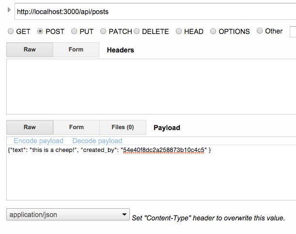
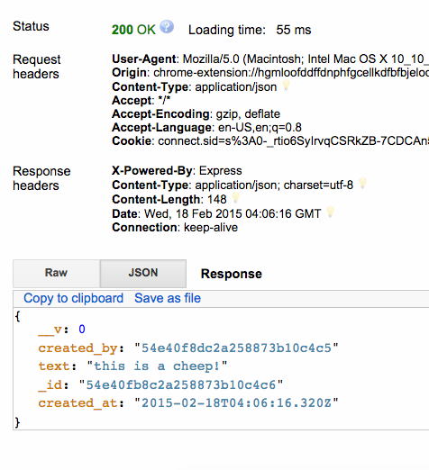

# Module 4: Integrating MongoDB

## Objective

By the end of this module you will know:

- What a Document Oriented Database is
- How to use [MongoDB](http://mongodb.org) from Node.js
- Using [Mongoose](http://npmjs.org/packages/mongoose) to create Schemas and Models
- Integrate MongoDB to route handlers

## Introduction

In the previous section we implemented authentication and the routing necessary for the apis of our application. Next we need actually imeplement the authentication scheme so that users are persisted in MongoDB as well as integrated MongoDB to the **/api/posts** routes to manipulate Posts within MongoDB.

This module picks up where [Module 3](../module-3) left off in the [Start](./Start) directory.

## Document Oriented Databases

Document Oriented Databases are quite different from tabular datastores in that items are stored as Documents, and data is generally enclosed within a single document. Rather than having tables and rows you have collections and documents in order to reduce the amount of joins you have to make.

Feel free to read more about this in our MongoDB MVA material [here](https://github.com/sedouard/mongodb-mva/tree/master/module1_intro_doc_dbs).

## MongoDB

MongoDB is a popular open source implementation of a Document Oriented Database. It contains collections and documents. Its easy to get started running MongoDB. After you've installed it go to your installation directory and spin up the local server:

```bash
# within /bin folder of your mongodb installation execute:
mkdir data
./mongod
```

Note some systems may require you to run as `sudo`.

The 'data' directory is required for mongoldb to store its data. It is also possible to store mongodb data elsewhere by specifying the `--dbpath` argument.

You'll get some output similar to below which will let you know that the MongoDB server is running:

```
2015-02-16T22:40:43.080-0800 [clientcursormon] mem (MB) res:36 virt:3550
2015-02-16T22:40:43.080-0800 [clientcursormon]  mapped (incl journal view):1056
2015-02-16T22:40:43.080-0800 [clientcursormon]  connections:0
2015-02-16T22:45:43.287-0800 [clientcursormon] mem (MB) res:13 virt:3550
2015-02-16T22:45:43.287-0800 [clientcursormon]  mapped (incl journal view):1056
2015-02-16T22:45:43.288-0800 [clientcursormon]  connections:0
2015-02-16T22:50:43.500-0800 [clientcursormon] mem (MB) res:13 virt:3550
2015-02-16T22:50:43.500-0800 [clientcursormon]  mapped (incl journal view):1056
2015-02-16T22:50:43.500-0800 [clientcursormon]  connections:0
2015-02-16T22:55:43.771-0800 [clientcursormon] mem (MB) res:13 virt:3550
2015-02-16T22:55:43.771-0800 [clientcursormon]  mapped (incl journal view):1056
2015-02-16T22:55:43.771-0800 [clientcursormon]  connections:0
2015-02-16T23:00:44.000-0800 [clientcursormon] mem (MB) res:13 virt:3550
2015-02-16T23:00:44.000-0800 [clientcursormon]  mapped (incl journal view):1056
2015-02-16T23:00:44.000-0800 [clientcursormon]  connections:0
2015-02-16T23:05:44.217-0800 [clientcursormon] mem (MB) res:13 virt:3550
2015-02-16T23:05:44.217-0800 [clientcursormon]  mapped (incl journal view):1056
2015-02-16T23:05:44.217-0800 [clientcursormon]  connections:0
2015-02-16T23:10:44.458-0800 [clientcursormon] mem (MB) res:13 virt:3550
2015-02-16T23:10:44.458-0800 [clientcursormon]  mapped (incl journal view):1056
2015-02-16T23:10:44.458-0800 [clientcursormon]  connections:0
2015-02-16T23:15:44.691-0800 [clientcursormon] mem (MB) res:13 virt:3550
```

## Creating Models with Mongoose

Now that we have our database running we should specify exactly what we're going to put into it. MongoDB data sort of looks like JSON objects. With data self enclosing as one unit. These units are called *documents* and are stored in *collections*.

We will use [mongoose](http://npmjs.org/packages/mongoose) as our Object Data Mapper that will allow us to specify a schema for our Post and User objects. Don't worry MongoDB is flexible and allows us to change our schema at any time. Mongoose jus helps us write it down and enforce it.

First we need to install mongoose:

```bash
nom install mongoose --save
```

Navigate to the [Start](./Start) directory and create a new folder called **models** and then a new file called **models.js**:

```bash
cd ./Start
mkdir models
cd models
touch models.js
```

Now open **models.js** and require mongoose.

```js
var mongoose = require('mongoose');
```

We will now create two [schemas](http://mongoosejs.com/docs/guide.html), one for Post and the other for User. Schemas are the way we specify to mongoose what kind of objects it can expect us to place in MongoDB. There is a 1:1 relationship between a Schema and a MongoDB [Collection](http://mongodb.github.io/node-mongodb-native/api-generated/collection.html).

First lets add the User schema to this file:

```js
var userSchema = new mongoose.Schema({
	username: String,
	password: String, //hash created from password
	created_at: {type: Date, default: Date.now}
});
```

This schema defines a User which contains a `username` and `password` of type `String` and a `created_at` property of type `Date`.

We also need a post schema to represent our 'Cheeps' entries when a user 
'Cheeps' a message:

```
var postSchema = new mongoose.Schema({
	created_by: { type: Schema.ObjectId, ref: 'User' },
	created_at: {type: Date, default: Date.now},
	text: String
});
```

The `created_by` is special type of field which references a User document in the Users collection.

Finally we need to use the schemas to register a User and Post [model]() with mongoose.

```js
mongoose.model('Post', postSchema);
mongoose.model('User', userSchema);
```

At the end of the requires section of **app.js** add this bootstrapping code which imports the mongoose module and connects us to the local database:

```js
var mongoose = require('mongoose');                         //add for Mongo support
mongoose.connect('mongodb://localhost/test-chirp');              //connect to Mongo
```

## Implementing the Authentication API to use MongoDB

In Module 3 we used an in-memory object to store the users. This was good as a proof of concept to test the routing layer in Express, however we need users to be persistent even if the server restarts. We can do this by changing the implementation to use MongoDB.

First, at the top of the **authenticate.js** file add mongoose and grab the Users schema:

```js
var mongoose = require('mongoose');   
var User = mongoose.model('User');
var LocalStrategy   = require('passport-local').Strategy;
var bCrypt = require('bcrypt');
//temporary data store
var users = {};
```
Also remove the `users` object as we won't be needing it anymore.

#### Login

Now lets start with our current `login` handler:

```js
passport.use('login', new LocalStrategy({
			passReqToCallback : true
		},
		function(req, username, password, done) { 

			if(users[username]){
				console.log('User Not Found with username '+username);
				return done(null, false);
			}

			if(isValidPassword(users[username], password)){
				//sucessfully authenticated
				return done(null, users[username]);
			}
			else{
				console.log('Invalid password '+username);
				return done(null, false)
			}
		}
	));
```

Everywhere we use the `users` dictionary we need to replace with a call to Mongoose. This is pretty easy since we have access to the Users model. First we'll fetch the user requested by passport:

```js

User.findOne({ 'username' :  username }, 
	function(err, user) {
		// In case of any error, return using the done method
		if (err)
			return done(err);
		// Username does not exist, log the error and redirect back
		if (!user){
			console.log('User Not Found with username '+username);
			return done(null, false);                 
		}
		// User exists but wrong password, log the error 
		if (!isValidPassword(user, password)){
			console.log('Invalid Password');
			return done(null, false); // redirect back to login page
		}
		// User and password both match, return user from done method
		// which will be treated like success
		return done(null, user);
	}
);
```

The findOne function is a convince function in mongoose (and within the mongodb driver itself) which finds the first element that matches the query.

A query object is provided to the function and is used to instruct MongoDb which document(s) to return. In our case MongoDB will retrieve the first user document which contains the `username` that matches the username requested by passport, which in turn is the username that the user will enter in the browser to login.

Once we execute, the callback provided by Node.js will provide us either with and error `err` or the `user`. If `user` is null we know that that user doesn't exist in the database. If we did get a user object we can then call the same `isValidPassword` function to validate the provided password. If this works we can call the `done` callback and provide the user object returned b MongoDb to passport.

#### Signup

We can do something similar with the Signup API. Let's look at our original implementation:

```js
passport.use('signup', new LocalStrategy({
			passReqToCallback : true // allows us to pass back the entire request to the callback
		},
		function(req, username, password, done) {

			if (users[username]){
				console.log('User already exists with username: ' + username);
				return done(null, false);
			}
	
			//store user in memory 
			users[username] = {
				username: username,
				password: createHash(password)
			}
			
			console.log(users[username].username + ' Registration successful');
			return done(null, users[username]);
		})
	);
```

Similar to the `login` mongodb implementation we need to fetch the user using the `findOne` function. If mongodb returns a user, we know that the user already exists and that we cannot register another user with the same name. Otherwise we create a new `User` set the `username` and `password` and save it to the database:

```js
// find a user in mongo with provided username
User.findOne({ 'username' :  username }, function(err, user) {
	// In case of any error, return using the done method
	if (err){
		console.log('Error in SignUp: '+err);
		return done(err);
	}
	// already exists
	if (user) {
		console.log('User already exists with username: '+username);
		return done(null, false);
	} else {
		// if there is no user, create the user
		var newUser = new User();

		// set the user's local credentials
		newUser.username = username;
		newUser.password = createHash(password);

		// save the user
		newUser.save(function(err) {
			if (err){
				console.log('Error in Saving user: '+err);  
				throw err;  
			}
			console.log(newUser.username + ' Registration successful');    
			return done(null, newUser);
		});
	}
});
```
#### Serialize User

Passport requires that we provide a unique ID which specifies each user in order to serialize them into the session. MongoDB creates a field called _id on every object it creates. We can use this as a strong guarantee of a unique identifier. 

Take look at our original in-memory implementation of the serialization handler:

```js
passport.serializeUser(function(user, done) {
		console.log('serializing user:',user.username);
		//return the unique id for the user
		done(null, user.username);
	});
```

Previously we had just used the `username` field as the key. Instead we'll use mongodbs `_id` field instead:

```js
// Passport needs to be able to serialize and deserialize users to support persistent login sessions
passport.serializeUser(function(user, done) {
	console.log('serializing user:',user.username);
	done(null, user._id);
});
```

#### Deserialize User

Passport also requires that we return a User given a key. Looking our original implementation we used `username`:

```js
//Desieralize user will call with the unique id provided by serializeuser
passport.deserializeUser(function(username, done) {

	return done(null, users[username]);

});
```

This is easy to do since mongoldb since passport will provide us with the `_id` field of the user we originally provided. By using the **findById** we can retrieve it from MongoDB:
	
```
passport.deserializeUser(function(id, done) {
	User.findById(id, function(err, user) {
		console.log('deserializing user:',user.username);
		done(err, user);
	});
});
```
#### Putting it all together

Putting everything together the full MongoDB implementation of the passport-init.js strategies is:

```js
var mongoose = require('mongoose');   
var User = mongoose.model('User');
var LocalStrategy   = require('passport-local').Strategy;
var bCrypt = require('bcrypt');

module.exports = function(passport){

	// Passport needs to be able to serialize and deserialize users to support persistent login sessions
	passport.serializeUser(function(user, done) {
		console.log('serializing user:',user.username);
		done(null, user._id);
	});

	passport.deserializeUser(function(id, done) {
		User.findById(id, function(err, user) {
			console.log('deserializing user:',user.username);
			done(err, user);
		});
	});

	passport.use('login', new LocalStrategy({
			passReqToCallback : true
		},
		function(req, username, password, done) { 
			// check in mongo if a user with username exists or not
			User.findOne({ 'username' :  username }, 
				function(err, user) {
					// In case of any error, return using the done method
					if (err)
						return done(err);
					// Username does not exist, log the error and redirect back
					if (!user){
						console.log('User Not Found with username '+username);
						return done(null, false);                 
					}
					// User exists but wrong password, log the error 
					if (!isValidPassword(user, password)){
						console.log('Invalid Password');
						return done(null, false); // redirect back to login page
					}
					// User and password both match, return user from done method
					// which will be treated like success
					return done(null, user);
				}
			);
		}
	));

	passport.use('signup', new LocalStrategy({
			passReqToCallback : true // allows us to pass back the entire request to the callback
		},
		function(req, username, password, done) {

			// find a user in mongo with provided username
			User.findOne({ 'username' :  username }, function(err, user) {
				// In case of any error, return using the done method
				if (err){
					console.log('Error in SignUp: '+err);
					return done(err);
				}
				// already exists
				if (user) {
					console.log('User already exists with username: '+username);
					return done(null, false);
				} else {
					// if there is no user, create the user
					var newUser = new User();

					// set the user's local credentials
					newUser.username = username;
					newUser.password = createHash(password);

					// save the user
					newUser.save(function(err) {
						if (err){
							console.log('Error in Saving user: '+err);  
							throw err;  
						}
						console.log(newUser.username + ' Registration succesful');    
						return done(null, newUser);
					});
				}
			});
		})
	);
	
	var isValidPassword = function(user, password){
		return bCrypt.compareSync(password, user.password);
	};
	// Generates hash using bCrypt
	var createHash = function(password){
		return bCrypt.hashSync(password, bCrypt.genSaltSync(10), null);
	};

};
```

## Implementing the Posts APIs with MongoDB

In the previous module we didn't implement the route handlers for the **/posts** and **/posts/:id** routes, we simply just put TODO's. Now we'll actually implement them since we have a place to store our Data.

### **/api/posts**
First, lets import mongoose and our Post model:

```js
var mongoose = require( 'mongoose' );
var Post = mongoose.model('Post');
```

Within **/routes/api.js** lets implement the .post handler for the **/posts** api route. First we'll create a new post, fill out the `text` and `created_by` fields and save it into mongodb. When the callback is executed we know that the post has been saved and we can respond successfully with the saved post body back to the client:

```
	//creates a new post
	.post(function(req, res){

		var post = new Post();
		post.text = req.body.text;
		post.created_by = req.body.created_by;
		post.save(function(err, post) {
			if (err){
				return res.send(500, err);
			}
			return res.json(post);
		});
	})
```

We'll do the same thing with the GET **/posts** API. In this case we'll call the `find` function on the Post collection without specifying a query object. This will return all the posts from the database. We can then simply send those to the client and it will automatically be sent as JSON.

```js
	//gets all posts
	.get(function(req, res){
		Post.find(function(err, posts){
			if(err){
				return res.send(500, err);
			}
			return res.send(posts);
		});
	});
```


### **/api/posts/:id**

To complete this router's implementation we'll have to add the mongodb implementation for post-specific commands. Let's start with the GET **/posts/:id** route:

```js
router.route('/posts/:id')
	//gets specified post
	.get(function(req, res){
		Post.findById(req.params.id, function(err, post){
			if(err)
				res.send(err);
			res.json(post);
		});
	}) 
```

As demonstrated in Module 3, the express routing layer will provide `params.id` because of the `:id` notation on the route. If the client calls the api with the mongodb ID **findById** will retrieve the correct document and return it as a json object.

The PUT method is similar in that we will attempt to retrieve the document by ID. We'll then modify the the existing document with the data provided in the request body and save it back to the database:

```
	//updates specified post
	.put(function(req, res){
		Post.findById(req.params.id, function(err, post){
			if(err)
				res.send(err);

			post.created_by = req.body.created_by;
			post.text = req.body.text;

			post.save(function(err, post){
				if(err)
					res.send(err);

				res.json(post);
			});
		});
	})
```

Finally, the DELETE method will simply delete the post out of the database using the **remove** function in the mongoose model:

```js
//deletes the post
	.delete(function(req, res) {
		Post.remove({
			_id: req.params.id
		}, function(err) {
			if (err)
				res.send(err);
			res.json("deleted :(");
		});
	});

```
Putting everything together our full **api.js** implementation looks like:

```js
var express = require('express');
var router = express.Router();

//Used for routes that must be authenticated.
function isAuthenticated (req, res, next) {
	// if user is authenticated in the session, call the next() to call the next request handler 
	// Passport adds this method to request object. A middleware is allowed to add properties to
	// request and response objects

	//allow all get request methods
	if(req.method === "GET"){
		return next();
	}
	if (req.isAuthenticated()){
		return next();
	}

	// if the user is not authenticated then redirect him to the login page
	return res.redirect('/#login');
};

//Register the authentication middleware
router.use('/posts', isAuthenticated);

router.route('/posts')
	//creates a new post
	.post(function(req, res){

		var post = new Post();
		post.text = req.body.text;
		post.created_by = req.body.created_by;
		post.save(function(err, post) {
			if (err){
				return res.send(500, err);
			}
			return res.json(post);
		});
	})
	//gets all posts
	.get(function(req, res){
		Post.find(function(err, posts){
			if(err){
				return res.send(500, err);
			}
			return res.send(posts);
		});
	});

//post-specific commands. likely won't be used
router.route('/posts/:id')
	//gets specified post
	.get(function(req, res){
		Post.findById(req.params.id, function(err, post){
			if(err)
				res.send(err);
			res.json(post);
		});
	}) 
	//updates specified post
	.put(function(req, res){
		Post.findById(req.params.id, function(err, post){
			if(err)
				res.send(err);

			post.created_by = req.body.created_by;
			post.text = req.body.text;

			post.save(function(err, post){
				if(err)
					res.send(err);

				res.json(post);
			});
		});
	})
	//deletes the post
	.delete(function(req, res) {
		Post.remove({
			_id: req.params.id
		}, function(err) {
			if (err)
				res.send(err);
			res.json("deleted :(");
		});
	});

module.exports = router;
```

## Testing with the REST Client

As before we can test with the Advanced REST Client Tool. For example after we authenticate we can verify we can create a post:




