# Deploying your MEAN App to the Cloud

## Objectives

By the end of this module you will know:

- How to create an Azure website
- Create & deploy our MEAN app using git
- Setting Environment Variables for your App

## Getting Started

First, go to the current Azure portal (manage.windowsazure.com) not to be confused with the new portal (portal.azure.com). In this portal we will create website by hitting the big '+' on the bottom left side and creating a new website with Quick Create.

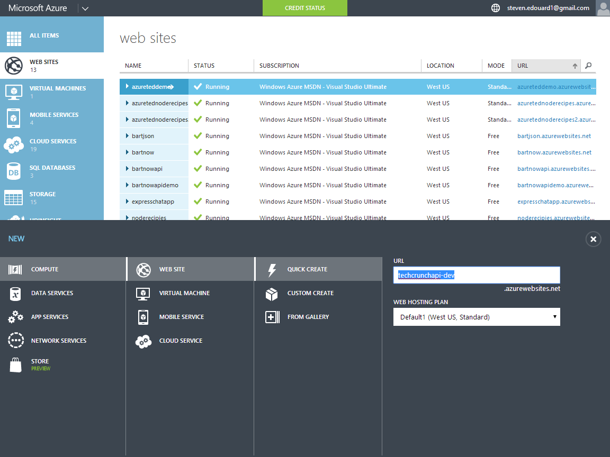

In your websites listing, you should see the the new website you just created:

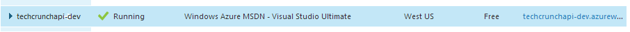

Click on the url and you'll see that you have an empty placeholder waiting for you:

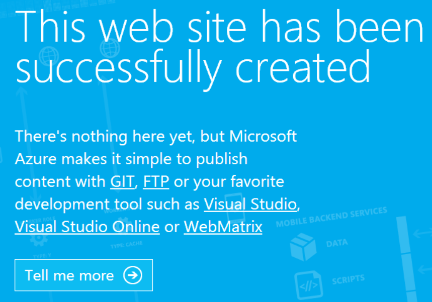

## Setting up a MongoDB Database

[MongoLab](http://mongolab.com) provides fully managed MongoDB databases. We can easily create one from the azure portal by just going to the **market palce** selecting **Data** service:

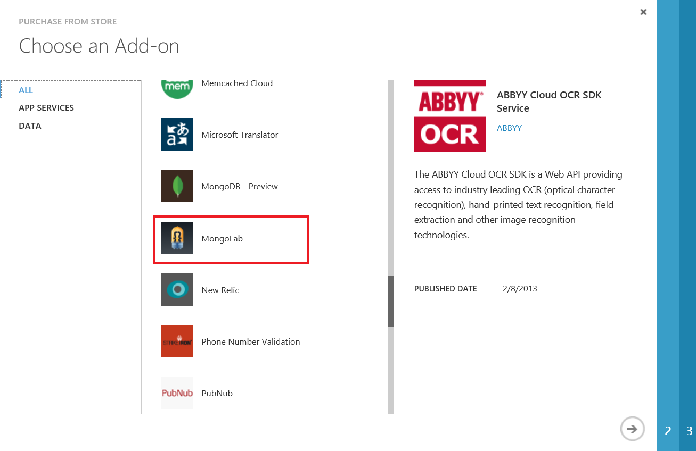

Then selecting a 'Sandbox' plan:

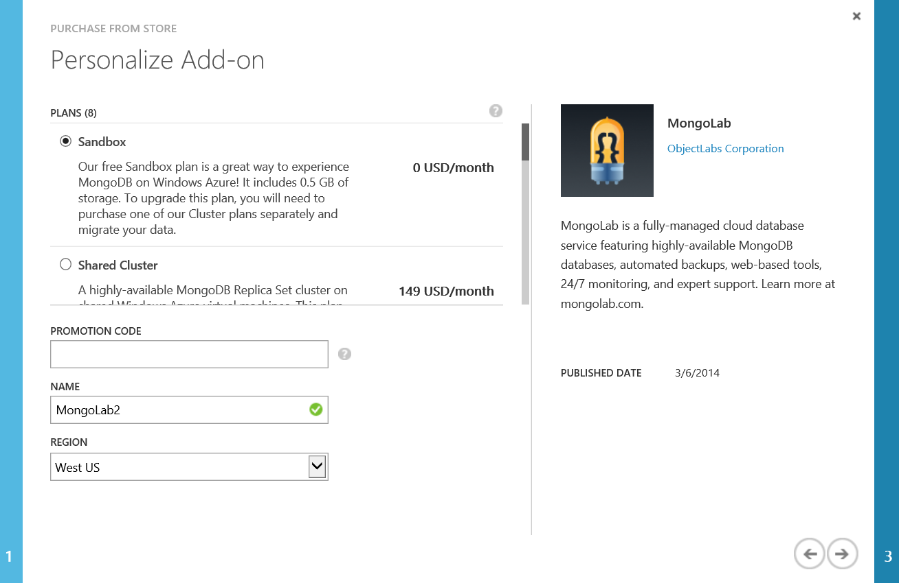

Afterwards you'll see your instance come online:

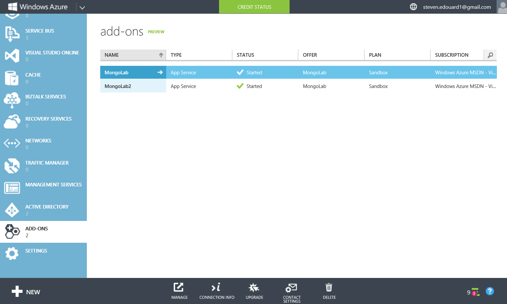

You can then click on the **Connection Info** button on the bottom:

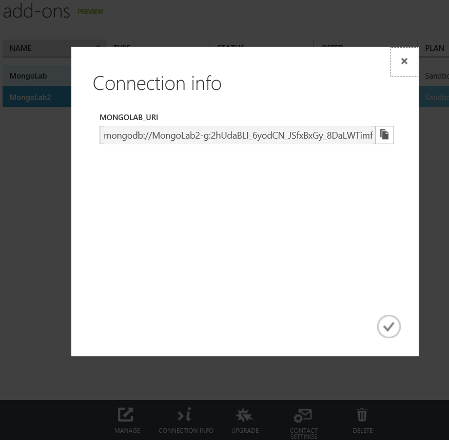

Now in your **app.js** modify where you do:

```js
mongoose.connect('mongodb://localhost/test-chirp');
```

To be:

```js
if(process.env.DEV_ENV){
	mongoose.connect('mongodb://localhost/test-chirp');
}
else{
	mongoose.connect('<Your mongolab connection string'>/chirp);
}
```

Now if you want to run your app locally again you'll have to set the environment variable **DEV_ENV**. However when you deploy to azure websites it will use your live database and your app will just work.

## Deploying Your MEAN App with Git

Open the site dashboard and if you haven't already done so click **Setup Deployment Credentials**. It will look like this but it won't say 'Reset' since this subscription already has set its git deploy credentials:

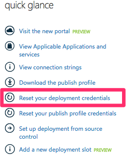

Now set your credentials:

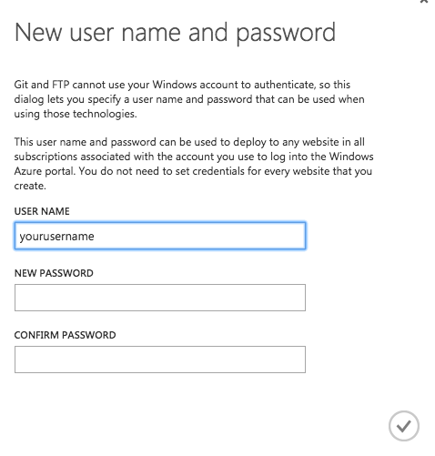

Now select **Setup Deployment from Source Control** and select **Local Git Repository**

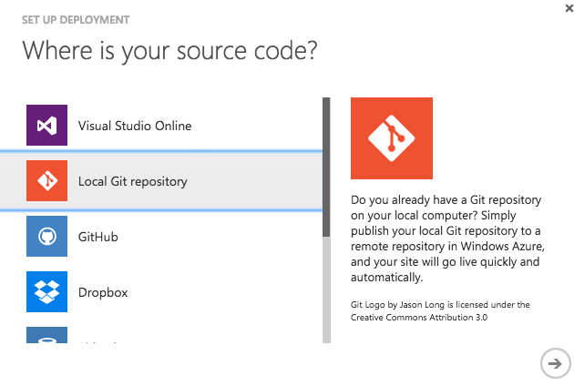

You'll be taken to the deployments tab where you'll be provided a git remote you can add to your local repo:

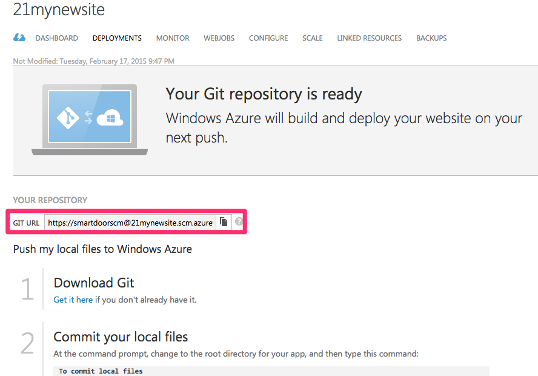

Copy the contents of the [Chirp](../chirp) folder over to a new folder. Now create a new repository and add a new remote `azure`:

```bash
# initialize the new repository
git init .
# add all the files
git add .
# commit everything
git commit . -m 'initial commit - Cheep!'
# add azure as a remote
git remote add azure <your remote url here>

```

Finally push the repository to azure. At this point git may prompt you for your source control credentials. Use the same credentials you setup in the previous steps.

```bash
# push to azure websites
git push azure master
```

Now navigate to the website address and you'll be able to see the application running live!:

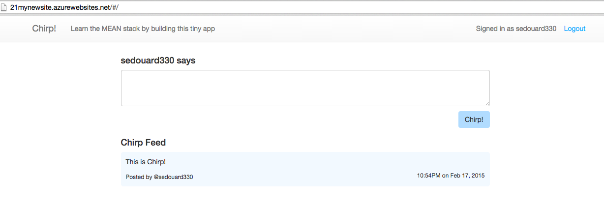


# More MEAN Tools


## Yeoman Generator

[Yeoman](http://yeoman.io) is an opinionated web scaffolding generator that creates apps based on a  set of technologies. Yeoman has a pretty nice MEAN stack application generator. You can generate a MEAN stack application by just doing:

```
npm install yo -jg
yo angular-fullstack
```

## Mocha Unit Test Framework

[Mocha](http://npmjs.org/packages/mocha) is a unit test framework for node.js which makes it easy to write your unit tests for your server.

## Angular Unit Test frameowrk

[Protractor](https://github.com/angular/protractor) is a popular test framework for angular.js